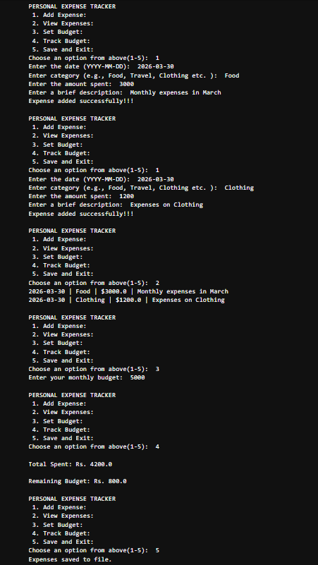

# Personal-expense-tracker
Personal Expense Tracker (Python CLI Application)

**Overview**

The Personal Expense Tracker is a command-line based Python application designed to help users efficiently manage their daily expenses and monitor their financial habits.
*This project demonstrates core Python concepts such as:*

- File handling (CSV)
- Functions & modular programming
- Data structures (lists & dictionaries)
- User interaction via CLI

**Features**
- Add expenses with date, category, amount, and description
- View all recorded expenses in a structured format
- Set a monthly budget
- Track total spending and remaining budget
- Automatic warning when budget is exceeded
- Persistent storage using CSV file

**Tech Stack**
- Technology	Purpose
- Python	Core programming language
- CSV Module	Data storage & retrieval
- CLI	User interaction

**Project Structure**
- personal-expense-tracker/

 - main.py            # Main application logic
 - expenses.csv       # Stored expense data
 - README.md          # Project documentation
 - requirements.txt   # Dependencies

**How to Run**

1️. Clone the repository
git clone https://github.com/Mozammil-Ansary/personal-expense-tracker.git

2️. Navigate to project folder
cd personal-expense-tracker

3️. Run the application
python main.py

**Sample Output**
PERSONAL EXPENSE TRACKER
1. Add Expense
2. View Expenses
3. Set Budget
4. Track Budget
5. Save and Exit

Total Spent: Rs. 7500
Remaining Budget: Rs. 2500

**Screenshot**

**Key Learnings**
- Practical implementation of file handling using CSV
- Managing structured data using dictionaries
- Building interactive command-line applications
- Writing modular and reusable Python functions
